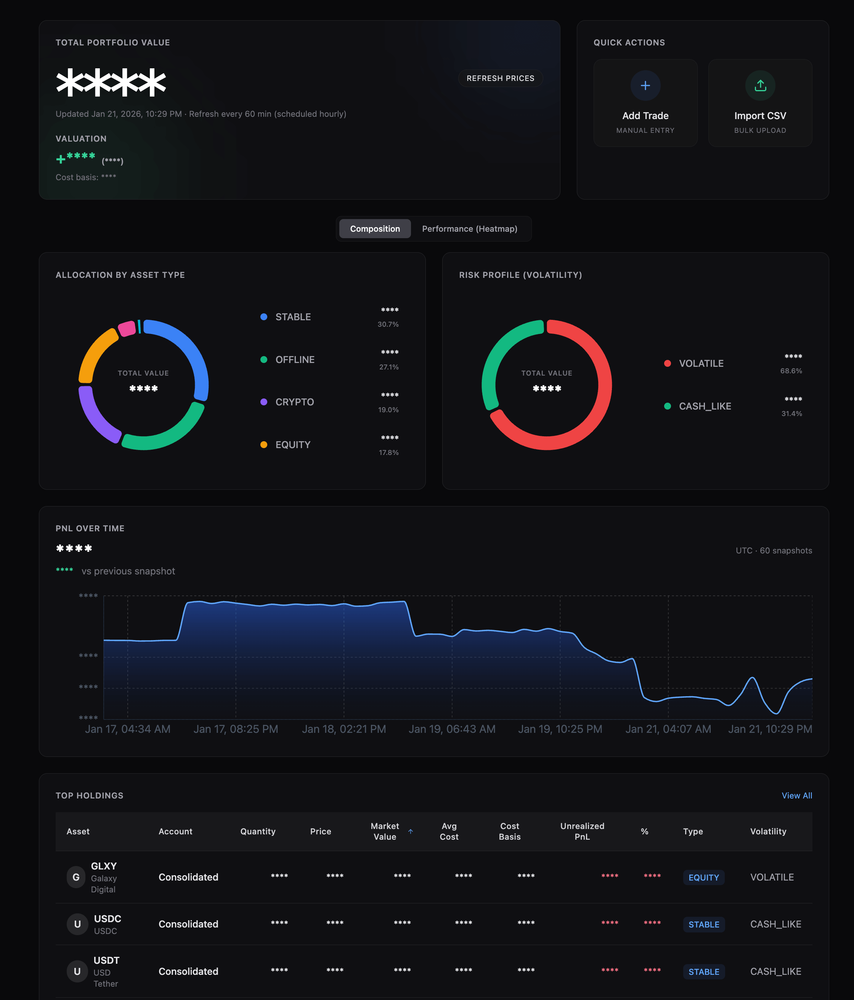

# TieQuan P&L Webapp



A Next.js-based portfolio and P&L tracking application with automated price fetching, rate limiting, and robust authentication.

## Overview

This webapp provides a comprehensive solution for tracking investment portfolios, including:
- Portfolio holdings and P&L calculations
- Historical P&L snapshots with filtered charts and a dedicated `/pnl` view
- Automated price fetching for crypto (CoinGecko) and equities (Finnhub)
- Rate-limited API calls with monitoring
- SQLite database with Prisma ORM
- Authentication via middleware
- Settings management for auto-refresh intervals

## Architecture

- **Framework**: Next.js 14 with App Router
- **Database**: SQLite with Prisma ORM
- **Authentication**: Single-user session-based auth via middleware
- **API**: RESTful endpoints for data management and price refreshing
- **Rate Limiting**: Custom rate limiter for CoinGecko API (30 calls/minute)
- **Deployment**: Vercel with scheduled cron jobs

## Quick Start

### Installing pnpm

If you don't have pnpm installed, you can install it using one of the following methods:

**Option 1: Using npm (recommended)**
```bash
npm install -g pnpm
```

**Option 2: Using curl**
```bash
curl -fsSL https://get.pnpm.io/install.sh | sh -
```

**Option 3: Using Homebrew (macOS)**
```bash
brew install pnpm
```

For more installation options, visit [pnpm.io/installation](https://pnpm.io/installation)

### Prerequisites

- Node.js 18+
- pnpm
- Git

### Installation

1. Clone the repository:
```bash
git clone <repository-url>
cd tiequan-pnl-webapp
```

2. Install dependencies:
```bash
pnpm install
```

3. Set up environment variables:
```bash
cp .env.example .env.local
```

4. Configure your environment variables (see [Environment Setup](#environment-setup))

5. Set up the database:
```bash
pnpm run prisma:generate
pnpm run prisma:migrate
```

6. Start the development server:
```bash
pnpm run dev
```

The application will be available at `http://localhost:1373`.

**TradeStation note:** TradeStation's default localhost callback allowlist typically includes port `3000` (but not `1373`). For TradeStation OAuth flows, run the dev server on port 3000:
```bash
pnpm run dev:ts
```
Then use `http://localhost:3000`.

## Environment Setup

Create a `.env.local` file in the root directory with the following variables:

```env
# Required: Password for application authentication
APP_PASSWORD=your-secure-password

# Required: Database connection string (SQLite)
DATABASE_URL="file:prisma/dev.db"

# --- TradeStation OAuth / Brokerage API (optional) ---
# Used to import orders into the ledger and (best-effort) price options from positions.
TRADESTATION_CLIENT_ID=your-tradestation-client-id
TRADESTATION_CLIENT_SECRET=your-tradestation-client-secret

# Redirect URI must match your TradeStation API key configuration.
# For local dev, TradeStation commonly only whitelists localhost roots (no path):
#   http://localhost:3000
# This app rewrites `/?code=...&state=...` to `/api/tradestation/auth/callback` internally.
TRADESTATION_REDIRECT_URI=http://localhost:3000

# Defaults to https://api.tradestation.com
TRADESTATION_BASE_URL=

# Space-separated scopes
# Recommended:
#   "openid offline_access profile MarketData ReadAccount Trade"
TRADESTATION_SCOPE=

# Required: Finnhub API key for equity price fetching
FINNHUB_API_KEY=your-finnhub-api-key

# Required: CoinGecko API key for crypto price fetching
# Get your free API key from: https://www.coingecko.com/en/api/documentation
COINGECKO_API_KEY=your-coingecko-api-key

# Optional: S3 backup configuration (required if you run backup scripts)
S3_BUCKET_NAME=your-s3-bucket-name
S3_REGION=us-east-1
AWS_ACCESS_KEY_ID=your-aws-access-key-id
AWS_SECRET_ACCESS_KEY=your-aws-secret-access-key
BACKUP_SCHEDULE="0 2 * * *"
BACKUP_RETENTION_DAYS=60
```

### Getting API Keys

**TradeStation API Key (Client ID/Secret):**
1. Request a TradeStation API Key from TradeStation Client Experience / Developer portal.
2. Ensure your API key has access to the scopes you need (commonly: `MarketData`, `ReadAccount`, `Trade`).
3. Ensure the key's **Allowed Callback URLs** include your local dev URL. Many keys include `http://localhost:3000` by default.

**Finnhub API Key:**
1. Sign up at [Finnhub](https://finnhub.io/)
2. Get your free API key from the dashboard
3. Add it to your `.env.local` file

**CoinGecko API Key:**
1. Sign up at [CoinGecko](https://www.coingecko.com/en/api/documentation)
2. Get your free API key (30 calls/minute limit)
3. Add it to your `.env.local` file

## Database Setup

The application uses SQLite with Prisma ORM. The database schema includes:

- **Asset**: Cryptocurrency and equity holdings
- **Account**: Trading accounts and platforms
- **LedgerTransaction**: Transaction history (signed quantities) plus valuation fields for cost basis (`unit_price_in_base`, `total_value_in_base`, `fee_in_base`). For DEPOSIT, YIELD, and trade-like entries, unit price or total value is required (use explicit `0` for zero-cost basis). `COST_BASIS_RESET` entries (quantity `0`) anchor cost basis as-of a timestamp, and CASH/STABLE assets are treated as 1:1 with the base currency so their cost basis can be inferred directly from quantity.
- **PriceLatest**: Latest price cache for assets
- **Setting**: Application configuration
- **PortfolioSnapshot**: History of tensile snapshots (timestamp, base currency, total value) plus denormalized components for asset/account breakdowns (see `PortfolioSnapshotComponent`).

### Initial Setup

1. Generate Prisma client:
```bash
pnpm run prisma:generate
```

2. Run database migrations:
```bash
pnpm run prisma:migrate
```

3. (Optional) Seed initial data through the application UI

### Database Schema

See [`prisma/schema.prisma`](prisma/schema.prisma) for the complete database schema definition.

## Authentication Flow

The application uses a simple single-user authentication system:

### Flow Overview

1. **Login Page**: User enters password at `/login`
2. **API Call**: Form POSTs to `/api/login`
3. **Validation**: Server compares password with `APP_PASSWORD`
4. **Session Creation**: Sets `app_session` cookie on success
5. **Middleware Protection**: All routes except `/login` and public API endpoints (`/api/login`, `/api/prices/refresh`, `/api/prices/health`, `/api/prices/rate-limit`) require a valid session
6. **Redirect**: Unauthenticated users are redirected to `/login`

### Key Components

- **Login Page**: [`app/login/page.tsx`](app/login/page.tsx)
- **Login API**: [`app/api/login/route.ts`](app/api/login/route.ts)
- **Middleware**: [`middleware.ts`](middleware.ts)
- **Authenticated Layout**: [`app/(authenticated)/layout.tsx`](app/(authenticated)/layout.tsx)

### Session Management

- Cookie-based sessions with `app_session` name
- Middleware enforces authentication on all protected routes
- Single-user system (no multi-user support)

## TradeStation Integration (OAuth + Sync)

This project supports importing recent TradeStation orders into the ledger and pricing option positions (best-effort) using the TradeStation API.

### Prerequisites

1. Set the TradeStation environment variables in `.env.local` (see [Environment Setup](#environment-setup)).
2. For local OAuth flows, run on port **3000** and set:
   - `TRADESTATION_REDIRECT_URI=http://localhost:3000`

TradeStation commonly whitelists only specific localhost callback URLs by default (often the *root* `http://localhost:3000`, not a path). This app supports that by rewriting:
- `GET /?code=...&state=...` → `/api/tradestation/auth/callback` (via `middleware.ts`).

### Connect a local Account to TradeStation

1. Log into the app at `/login` (required; most TS routes are authenticated).
2. Create a local account at `/accounts/new`:
   - `platform`: `TradeStation`
   - `account_type`: `BROKER`
   - `status`: `ACTIVE`
3. Note the local account id (`Account.id`).
4. Start OAuth:

   `GET /api/tradestation/auth/start?accountId=<LOCAL_ACCOUNT_ID>`

5. After approving in TradeStation you will be redirected back and a `TradeStationConnection` record will be created/updated.
6. Check status:

   `GET /api/tradestation/status?accountId=<LOCAL_ACCOUNT_ID>`

7. (Optional) If your TradeStation login has multiple brokerage accounts, list and link the correct one:

   - List: `GET /api/tradestation/accounts?accountId=<LOCAL_ACCOUNT_ID>`
   - Link: `POST /api/tradestation/accounts` with body:
     ```json
     { "accountId": 42, "tsAccountId": "11613055" }
     ```

### Sync orders into the ledger

- UI helper (recommended):

  `GET /api/tradestation/sync?accountId=<LOCAL_ACCOUNT_ID>`

  This page submits `POST /api/tradestation/sync`.

- The TradeStation **Historical Orders** endpoint has a **maximum 90-day lookback**. This means the automatic sync can only import the last ~90 calendar days of history unless TradeStation provides an alternative export method.

### Pricing options via TradeStation

`POST /api/prices/refresh` now also attempts to price `OPTION` assets by calling TradeStation **Positions** for the connected account and using a best-effort mark:
- Prefer **mid price** `(bid + ask) / 2`
- Fallback to `Last`
- Fallback to `MarkToMarketPrice`

This only prices option contracts that appear in **current positions**.

## Pricing API Endpoints

The application provides several endpoints for price management and monitoring:

### Price Refresh Endpoints

#### Batch Refresh: `POST /api/prices/refresh`

Refreshes prices for all assets with `AUTO` pricing mode.

**Response:**
```json
{
  "refreshed": [1, 2],
  "failed": [
    {
      "id": 3,
      "symbol": "INVALID",
      "type": "CRYPTO",
      "error": "No price data returned from API"
    }
  ],
  "rateLimitStats": {
    "currentCalls": 1,
    "maxCalls": 30,
    "remainingCalls": 29,
    "usagePercentage": 3,
    "status": "healthy",
    "timeWindowMs": 60000,
    "nextAvailableSlot": 1700000000000
  },
  "processed": {
    "crypto": 2,
    "equity": 0,
    "option": 0,
    "total": 2
  },
  "summary": {
    "successCount": 2,
    "failureCount": 1,
    "successRate": "66.7%",
    "duration": "2500ms"
  }
}
```

#### Single Asset Refresh: `POST /api/prices/refresh/[assetId]`

Refreshes price for a specific asset by ID.

**Response:**
```json
{
  "assetId": 123,
  "refreshed": true
}
```

#### Rate Limit Status: `GET /api/prices/rate-limit`

Returns current rate limiting statistics and recommendations.

**Response:**
```json
{
  "success": true,
  "data": {
    "currentCalls": 5,
    "maxCalls": 30,
    "remainingCalls": 25,
    "usagePercentage": 17,
    "status": "healthy",
    "timeWindowMs": 60000,
    "nextAvailableSlot": 1700000000000,
    "callHistory": [
      { "timestamp": 1700000000000, "timeAgo": "5s ago" }
    ],
    "recommendations": [
      "Rate limit usage is healthy."
    ]
  },
  "timestamp": "2025-12-31T23:59:59.999Z"
}
```

#### Health Check: `GET /api/prices/health`

Basic health check for pricing system.

**Response:**
```json
{
  "status": "healthy",
  "timestamp": "2025-12-31T23:59:59.999Z",
  "responseTime": "120ms",
  "metrics": {
    "autoAssetsCount": 12,
    "totalAssetsWithPrices": 12,
    "recentUpdatesInLast2Hours": 10,
    "priceUpdateCoverage": "83.3%"
  },
  "rateLimit": {
    "currentCalls": 3,
    "maxCalls": 30,
    "remainingCalls": 27,
    "usagePercentage": 10,
    "status": "healthy",
    "timeWindowMs": 60000,
    "nextAvailableSlot": 1700000000000
  },
  "settings": {
    "priceAutoRefresh": true,
    "priceAutoRefreshIntervalMinutes": 60,
    "priceRefreshEndpoint": "/api/prices/refresh"
  },
  "checks": {
    "database": "connected",
    "apiKeys": {
      "coingecko": true,
      "finnhub": true
    },
    "responseTime": "pass",
    "rateLimit": "pass"
  }
}
```

#### PNL History: `GET /api/pnl`

Returns a time-series of portfolio snapshots recorded after each successful price refresh. Filters mirror the holdings view and support:
- `from` / `to` (ISO dates)
- `limit` (number of points, default ~60)
- `accountIds`, `assetTypes`, `volatilityBuckets` (comma-separated)

**Response:**
```json
{
  "baseCurrency": "USD",
  "timezone": "America/New_York",
  "points": [
    {
      "snapshotAt": "2025-08-20T14:00:00.000Z",
      "totalValue": 125000.5,
      "byType": { "CRYPTO": 100000, "EQUITY": 25000 },
      "byVolatility": { "VOLATILE": 90000, "CASH_LIKE": 35000 },
      "byAccount": {
        "1": { "name": "Binance", "value": 90000 },
        "2": { "name": "Interactive Brokers", "value": 35000 }
      }
    }
    // More snapshots...
  ]
}
```

## API Endpoints
### Cost Basis Recalculation

#### Recalculate & Persist: `POST /api/ledger/cost-basis-recalc`

Replays the ledger to recompute cost basis (transfer-aware) and persists results as `COST_BASIS_RESET` entries.

**Request:**
```json
{
  \"as_of\": \"2025-12-31T23:59:59Z\",
  \"mode\": \"PURE\",
  \"external_reference\": \"RECALC:2025-12-31\",
  \"notes\": \"Recalc (PURE) as of 2025-12-31\"
}
```

**Response:**
```json
{
  \"as_of\": \"2025-12-31T23:59:59.000Z\",
  \"mode\": \"PURE\",
  \"created\": 128,
  \"skippedUnknown\": 4,
  \"skippedZeroQuantity\": 2,
  \"external_reference\": \"RECALC:2025-12-31T23:59:59.000Z\",
  \"diagnostics\": []
}
```

**Modes:**
- `PURE` ignores existing cost basis resets.
- `HONOR_RESETS` applies existing resets during replay.

**Diagnostics:**
- Transfer pairing issues are returned in `diagnostics` and logged server-side for review.

### Ledger Valuation Requirements

- `DEPOSIT`, `YIELD`, `TRADE`, `NFT_TRADE`, `OFFLINE_TRADE`, and `HEDGE` require either `unit_price_in_base` or `total_value_in_base`.
- Zero-cost basis must be explicit (`0`), not `null`.

## CoinGecko Refresh Lifecycle

The application implements a robust price refresh system with rate limiting and error handling.

### Refresh Process

1. **Asset Query**: Finds all assets with `AUTO` pricing mode
2. **Batch Processing**: Groups assets by type (crypto vs equity)
3. **Rate Limiting**: Enforces 30 calls/minute limit for CoinGecko
4. **API Calls**: Fetches prices with exponential backoff retry
5. **Database Update**: Upserts to `PriceLatest` table
6. **Logging**: Comprehensive operation logging

### Rate Limiting

The custom rate limiter ([`lib/rateLimiter.ts`](lib/rateLimiter.ts)) provides:

- **30 calls/minute** limit for CoinGecko API
- **Exponential backoff** for failed requests
- **Call history tracking** for monitoring
- **Adaptive recommendations** based on usage patterns

### Error Handling

- **Retry Logic**: Up to 3 retries with exponential backoff
- **Graceful Degradation**: Failed assets don't block successful ones
- **Detailed Logging**: All operations logged with timestamps
- **Status Reporting**: Comprehensive success/failure reporting

### Symbol Normalization

The pricing system includes symbol mapping and overrides:

```typescript
// Example overrides in lib/pricing.ts
const COINGECKO_OVERRIDES: Record<string, string> = {
  'BTC': 'bitcoin',
  'ETH': 'ethereum',
  'USDT': 'tether',
  // ... more mappings
}
```

## Automated Refresh

The application supports automated price refresh through:

### GitHub Actions Workflow

The application uses GitHub Actions to automate price refresh via the workflow file `.github/workflows/price-refresh.yml`:

- **Schedule**: Runs every hour at the beginning of each hour (`0 * * * *`)
- **Endpoint**: Calls `/api/prices/refresh` automatically
- **Manual Trigger**: Workflow can also be manually triggered via GitHub Actions UI
- **Mode Detection**: Includes `X-Refresh-Mode: auto` header to differentiate scheduled vs manual runs
- **Interval Enforcement**: Scheduled runs honor the `priceAutoRefreshIntervalMinutes` setting; the system skips the run if the configured interval has not passed since the last successful or partial refresh.
- **Settings Toggle**: Scheduled runs also respect the `priceAutoRefresh` setting; if disabled, the refresh is skipped.
- **Concurrency Guard**: A built-in mutex prevents overlapping refreshes; if a run is already in progress, new requests are blocked with a `409 Conflict`.
- **Execution History**: All refresh attempts (manual and auto) are recorded in the `PriceRefreshRun` table for audit and monitoring.

### Manual Refresh

Users can trigger manual refresh through:

- **Settings Page**: `/settings` includes a refresh button
- **Direct API Call**: POST to `/api/prices/refresh`
- **Individual Asset**: POST to `/api/prices/refresh/[assetId]`

### Monitoring

Monitor the refresh system through:

- **Rate Limit Endpoint**: `/api/prices/rate-limit`
- **GitHub Actions**: Check the Actions tab in your repository for workflow execution history
- **Application Logs**: Check your hosting platform's function logs
- **Database**: Query `PriceLatest` table for freshness
- **Health Endpoint**: `/api/prices/health` (publicly accessible)

## Settings Management

The application includes a settings system for configuration:

### Available Settings

- **baseCurrency**: Base currency for portfolio (fixed to "USD")
  - Note: Base currency is locked to USD as all pricing providers (CoinGecko and Finnhub) return USD values
  - This setting is read-only in the UI to prevent incorrect currency formatting
- **timezone**: User timezone for date display
- **priceAutoRefresh**: Enable/disable automatic price refresh
- **priceAutoRefreshIntervalMinutes**: Interval for auto-refresh
- **priceRefreshEndpoint**: Custom endpoint for price refresh

### Settings API

- **GET /api/settings**: Retrieve current settings
- **POST /api/settings**: Update settings

### Settings UI

Access settings through the authenticated `/settings` page.
- Includes a cost basis recalculation trigger that calls `POST /api/ledger/cost-basis-recalc`.
- **Interactive Transfer Resolution**: Unmatched transfer legs are displayed with an interface to easy resolve them:
  - **Match Together**: Forces separate transactions to be treated as a single transfer by syncing timestamps and ID.
  - **Treat as Separate**: Converts generic transfers into independent Deposits/Withdrawals to clear warnings.

## Development

### Project Structure

```
app/
├── (authenticated)/          # Protected routes
│   ├── layout.tsx           # Authenticated layout wrapper
│   ├── page.tsx             # Dashboard
│   ├── accounts/            # Account management
│   ├── assets/              # Asset management
│   ├── holdings/            # Portfolio holdings
│   ├── pnl/                 # PNL time-series view with filters
│   ├── ledger/              # Transaction ledger
│   └── settings/            # Application settings
├── api/                     # API routes
│   ├── login/               # Authentication
│   ├── prices/              # Price management
│   ├── accounts/            # Account CRUD
│   ├── assets/              # Asset CRUD
│   └── settings/            # Settings management
└── login/                   # Login page

lib/
├── db.ts                    # Prisma client setup
├── pnlSnapshots.ts          # Portfolio snapshot persistence helpers
├── pricing.ts               # Price fetching logic
├── rateLimiter.ts           # Rate limiting implementation
└── settings.ts              # Settings management

prisma/
└── schema.prisma            # Database schema
```

### Key Libraries

- **Next.js 14**: React framework with App Router
- **Prisma**: Database ORM and migrations
- **Tailwind CSS**: Styling framework
- **Lucide React**: Icon library
- **Recharts**: Chart library for visualizations

### Development Scripts

```bash
pnpm run dev          # Start development server (port 1373)
pnpm run build        # Build for production
pnpm run start        # Start production server
pnpm run lint         # Run ESLint
pnpm run prisma:generate  # Generate Prisma client
pnpm run prisma:migrate   # Run database migrations
```

### Maintenance Scripts

```bash
node scripts/repair-null-yield-valuation.js           # Dry-run: report YIELD/DEPOSIT rows missing total_value_in_base
node scripts/repair-null-yield-valuation.js --apply   # Backfill missing totals (and unit price when absent)
```

## Deployment

### GitHub Actions Deployment

1. **Connect Repository**: Link your GitHub repository to your hosting platform
2. **Environment Variables**: Add all required environment variables
3. **Deploy**: Your platform will automatically build and deploy
4. **Price Refresh**: The included GitHub Actions workflow will handle hourly price refresh automatically
5. **Secrets Setup**: Configure the required secrets in your GitHub repository for the workflow

### Environment Variables for Production

Ensure all variables from `.env.example` are set in your hosting platform:

- `APP_PASSWORD`
- `DATABASE_URL`
- `FINNHUB_API_KEY`
- `COINGECKO_API_KEY`
- `S3_BUCKET_NAME` (required if you run backups)
- `S3_REGION`
- `AWS_ACCESS_KEY_ID`
- `AWS_SECRET_ACCESS_KEY`
- `BACKUP_SCHEDULE`
- `BACKUP_RETENTION_DAYS`
 
When running on your own server with PM2, point the process at `ecosystem.config.js` (provided in the repo). That file loads `.env` using `dotenv`, sets `cwd` to the repo root, and exposes the same vars the rest of the app expects, so you do not need to pass every env var manually to `pm2`.

### GitHub Actions Secrets

For the price refresh workflow to function, configure these secrets in your GitHub repository:

- `REFRESH_ENDPOINT_URL`: Full URL to your deployed `/api/prices/refresh` endpoint
- `REFRESH_AUTH_HEADER`: Optional authentication header if your middleware requires auth

### Database Considerations

- **Production Database**: The app uses SQLite in all environments; ensure your host provides a persistent file system or volume for the database file (Vercel's default filesystem is ephemeral)
- **Migrations**: Run migrations during deployment
- **Backups**: Set up regular database backups
- **SQLite Path Resolution**: The server now normalizes `DATABASE_URL` by searching upward from both the current working directory and the compiled module directory for the repo root before resolving relative `file:` URLs, so refer to `prisma/dev.db` only relative to the project root and let the helper turn it into an absolute path.

## Monitoring and Troubleshooting

### Common Issues

#### Authentication Problems

**Issue**: Can't log in despite correct password
**Solution**: 
- Check `APP_PASSWORD` environment variable
- Clear browser cookies
- Check browser console for errors
- The backend now checks `x-forwarded-proto` (and the referer) before applying `secure` to the `app_session` cookie, so HTTP deployments behind a proxy still receive the cookie when the password is valid. You only need to ensure `APP_PASSWORD` matches on the running server; the middleware keeps redirecting until that cookie exists.

#### Price Refresh Failures

**Issue**: Prices not updating
**Solution**:
- Check API keys are valid
- Monitor rate limit status at `/api/prices/rate-limit`
- Check Vercel function logs
- Verify assets have `AUTO` pricing mode

#### Rate Limiting Issues

**Issue**: Hitting CoinGecko rate limits
**Solution**:
- Monitor usage at `/api/prices/rate-limit`
- Consider upgrading CoinGecko plan
- Adjust refresh intervals

#### Database Issues

**Issue**: Database connection problems
**Solution**:
- Check `DATABASE_URL` environment variable
- Run migrations: `pnpm run prisma:migrate`
- Check Prisma client generation

### Monitoring Endpoints

- **Health Check**: `GET /api/prices/health`
- **Rate Limit Status**: `GET /api/prices/rate-limit`
- **Settings**: `GET /api/settings`

### Logging

The application includes comprehensive logging:

- **Pricing Operations**: All price fetch operations are logged
- **Rate Limiting**: Rate limiter tracks call history
- **Errors**: Detailed error logging with context
- **Performance**: Operation duration tracking

### Performance Optimization

- **Batch Processing**: Crypto prices fetched in batches
- **Rate Limiting**: Prevents API abuse and optimizes usage
- **Caching**: Latest prices cached in database
- **Retry Logic**: Exponential backoff for failed requests

## Contributing

1. Fork the repository
2. Create a feature branch
3. Make your changes
4. Test thoroughly
5. Submit a pull request

### Development Guidelines

- Follow existing code style
- Add appropriate error handling
- Update documentation
- Test rate limiting behavior
- Verify database migrations

## License

This project is licensed under the MIT License.

## Support

For issues and questions:

1. Check this README for common solutions
2. Review the troubleshooting section
3. Check existing GitHub issues
4. Create a new issue with detailed information

---

**Note**: This application is designed for single-user use. For multi-user scenarios, additional authentication and authorization logic would be required.
